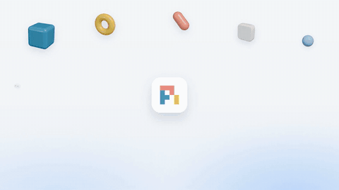
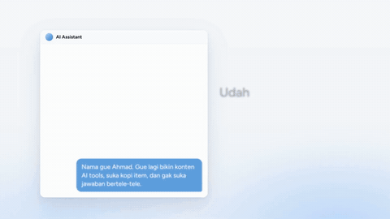
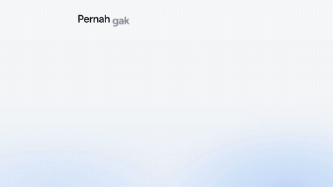
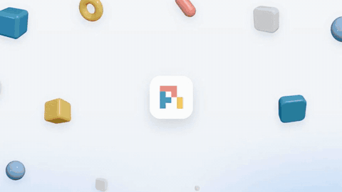

<div align="center">

# motioncraft

**Bikin video motion graphics yang rapi dan berkelas, dikerjain AI agent kamu pakai Remotion.**

Kasih agent kamu satu topik (atau video yang kamu suka). Dia riset, nulis naskah, nyamain tiap kata sama suara, bikin musik dan sound effect sendiri, nyusun videonya, ngecek tiap frame biar gak ada teks tabrakan, terus render.

```bash
npx skills add ahmdd4vd/motioncraft
```

[English](README.md) · Bahasa Indonesia

</div>

## Contoh hasil motioncraft

Klik preview-nya buat nonton video lengkap pakai suara.

<table>
<tr>
<td width="50%"><a href="https://github.com/ahmdd4vd/motioncraft/releases/download/v0.1.0/pi-v2.mp4"></a><br><b>Explainer agent harness</b> · 61 detik · Inggris · pi-v2</td>
<td width="50%"><a href="https://github.com/ahmdd4vd/motioncraft/releases/download/v0.1.0/hindsight.mp4"></a><br><b>Hindsight: memori buat agent</b> · 66 detik · Indonesia</td>
</tr>
<tr>
<td width="50%"><a href="https://github.com/ahmdd4vd/motioncraft/releases/download/v0.1.0/impeccable.mp4"></a><br><b>Impeccable: website buatan AI jadi lebih bagus</b> · 83 detik · Indonesia</td>
<td width="50%"><a href="https://github.com/ahmdd4vd/motioncraft/releases/download/v0.1.0/tutorial.mp4"></a><br><b>Tutorial: bikin video pakai AI agent</b> · 53 detik · Indonesia</td>
</tr>
</table>

## Bisa apa aja

| | |
|---|---|
| **Gaya siap pakai** | 5 gaya (`pi-v2`, `pi-v2-dark`, `warm-paper`, `mono-editorial`, `tech-neon-soft`), semua diatur dari satu file token. Atau kasih video yang kamu suka, nanti dia tiru *feel*-nya. |
| **Teks pas sama suara** | Kata muncul pas diucapin (timing per kata dari Whisper, atau dari jeda kalau Whisper gak ada). |
| **Musik original** | 7 preset musik instrumental yang dibikin langsung di laptop kamu, gak ada urusan lisensi. Ada pengaman biar tiap video gak kedengeran sama. |
| **Sound design** | 16 sound effect dalam 5 pack, nempel ke beat, di-mix ke -14 LUFS. |
| **Template Remotion** | Headline, kartu UI, checklist, counter, step card, bentuk 3D beneran, maskot, end card. |
| **QA otomatis** | Ngecek tiap frame: teks tabrakan, kartu numpuk, teks kepinggiran, plus loudness dan ukuran file. |
| **Siap dibagiin** | Preset render buat WhatsApp (di bawah 16 MB), Instagram, YouTube, dan file master. |

## Install

```bash
npx skills add ahmdd4vd/motioncraft
```

Jalan di AI agent apa aja yang dukung [Agent Skills](https://agentskills.io) - Claude Code, Codex, Cursor, Gemini CLI, Pi, Hermes Agent, dan banyak lagi (di-install pakai [skills CLI](https://github.com/vercel-labs/skills), ada juga di [skills.sh](https://skills.sh)).

Butuh **Node.js 18+**. Remotion dan lainnya di-install per project video. Opsional: Python + faster-whisper (timing per kata), yt-dlp (download video referensi).

## Cara pakai

Tinggal minta ke agent kamu:

> Bikinin video explainer 60 detik tentang \<topik\> pakai gaya motioncraft pi-v2, 16:9, voiceover bahasa Indonesia.

> Ini video yang gue suka: \<link\>. Bikinin yang kayak gini tentang \<topik\>.

Agent-nya ngikutin alur: **brief → riset → naskah → suara → musik & SFX → build → QA → render → feedback kamu**. Kamu approve naskah dulu sebelum ada suara atau render, dan kamu dapet screenshot dulu sebelum video full.

## CLI

Semua yang dikerjain skill ini juga bisa dijalanin manual:

```bash
node skills/motioncraft/scripts/motioncraft.mjs doctor               # cek laptop kamu
node skills/motioncraft/scripts/motioncraft.mjs new my-video --style pi-v2
node skills/motioncraft/scripts/motioncraft.mjs music make --preset dreamy --duration 52 --drop 12.9
node skills/motioncraft/scripts/motioncraft.mjs qa overlap --comp Main
node skills/motioncraft/scripts/motioncraft.mjs render --preset wa --audio audio/final.wav
```

Jalanin `... help` buat liat semua command.

## Isinya

```
skills/motioncraft/
  SKILL.md          alur kerja yang diikutin agent
  references/       15 panduan singkat (naskah, suara, musik, tipografi, QA, taste...)
  scripts/          CLI motioncraft (engine audio pure Node, analisis, QA, render)
  assets/template/  project Remotion
  styles/           token + catatan buat tiap gaya
```

## Lisensi

MIT - liat [LICENSE](LICENSE). Remotion punya lisensi sendiri: gratis buat individu dan perusahaan kecil, perusahaan yang lebih besar butuh company license. Cek [remotion.dev/license](https://www.remotion.dev/license).

Kredit topik dan tools di video contoh: [CREDITS.md](CREDITS.md).
