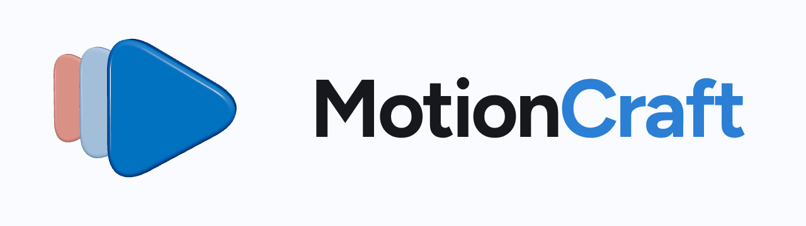
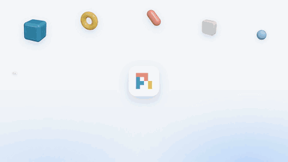
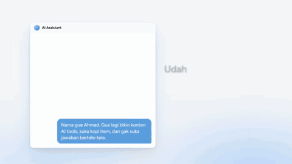
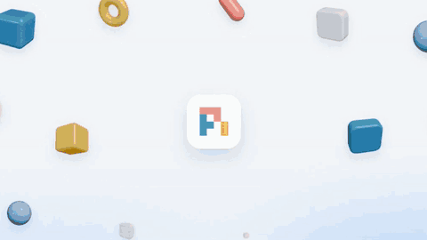

<div align="center">



**Clean, high-taste motion graphics videos, made by your AI agent with Remotion.**

Give your agent a topic (or a video you like). It researches, writes the script, times every word to the voice, makes original music and sound effects, builds the video, checks the exported pixels and audio, and renders.

```bash
npx skills add ahmdd4vd/motioncraft
```

English · [Bahasa Indonesia](README.id.md)

</div>

## Made with motioncraft

Click a preview to watch the full video with sound.

<table>
<tr>
<td width="50%"><a href="https://github.com/ahmdd4vd/motioncraft/releases/download/v0.1.0/pi-v2.mp4"></a><br><b>Agent harness explainer</b> · 61 s · English · pi-v2</td>
<td width="50%"><a href="https://github.com/ahmdd4vd/motioncraft/releases/download/v0.1.0/hindsight.mp4"></a><br><b>Hindsight: agent memory</b> · 66 s · Indonesian</td>
</tr>
<tr>
<td width="50%"><a href="https://github.com/ahmdd4vd/motioncraft/releases/download/v0.1.0/impeccable.mp4"></a><br><b>Impeccable: better AI-made websites</b> · 83 s · Indonesian</td>
<td width="50%"><a href="https://github.com/ahmdd4vd/motioncraft/releases/download/v0.1.0/tutorial.mp4"></a><br><b>Tutorial: make videos with an AI agent</b> · 53 s · Indonesian</td>
</tr>
</table>

## What it does

| | |
|---|---|
| **Locked styles** | 5 ready styles (`pi-v2`, `pi-v2-dark`, `warm-paper`, `mono-editorial`, `tech-neon-soft`), all from one tokens file. Or point it at a video you like and it copies the *feel*. |
| **Voice-synced text** | Words appear exactly when they are spoken (word timings from Whisper, or pauses as a fallback). |
| **Original music** | 7 instrumental presets synthesized on your machine, no licensing. A variety guard stops every video from sounding the same. |
| **Sound design** | 16 synthesized sound effects in 5 packs, snapped to the beat, mixed to -14 LUFS. |
| **Remotion template** | Headlines, UI cards, checklists, counters, step cards, real 3D shapes, mascot, end card. |
| **Honest QA** | Debug-box overlap checks plus samples from the final export: contact sheets, phone-size text and 9:16 UI-zone flags, headline-area and font checks. Samples are review leads, not proof every frame is clear. |
| **Ready to share** | Render presets for WhatsApp (under 16 MB), Instagram, YouTube and a master file. |

## New in v0.2

- **Storyboard and quick preview.** `storyboard` turns a brief into exact scene frame ranges and a copy-review scaffold. After you build the scenes, `preview` renders real stills and a contact sheet. `cache3d` stores expensive 3D frames so text/audio edits do not rerender WebGL. This does not write or approve the script for you. [Planning guide](skills/motioncraft/references/phase1-planning-and-preview.md).
- **Timeline audio.** Annotate scene events such as typing, clicks, transitions, logo reveal and CTA, then use `sfx auto` for sparse timed cues. `music moods` helps pick an instrumental preset per video; `mix --duration` makes the final bed match the video length with a fade. Listen to the mix and use `mix review --approve` before rendering with audio. Events come from the brief, not visual detection. [Audio guide](skills/motioncraft/references/phase2-timeline-audio.md).
- **Final-pixel QA.** `qa pixels` samples the exported video and writes full-size frames, a contact sheet and review flags for tiny phone text, 9:16 app UI zones, crowded headline areas and font imports. Open the actual frames, watch the whole video and listen to its audio: neither this sample nor `qa overlap` certifies zero collisions. [Pixel QA guide](skills/motioncraft/references/phase3-pixel-review.md).
- **Two pi-v2 templates.** `ProductLaunch` (30-60 s) lays out problem → real demo → verified features → CTA. `ScreenTutorial` (30-90 s vertical) adds focus zoom, pointer highlight and captions below the recording panel. Both show DO NOT PUBLISH placeholders until real captures and source credits are added; `template launch|tutorial` validates props and frame files, not authenticity or licenses. [Template guide](skills/motioncraft/references/phase4-templates.md).

## Install

```bash
npx skills add ahmdd4vd/motioncraft
```

Works with any AI agent that supports [Agent Skills](https://agentskills.io) - Claude Code, Codex, Cursor, Gemini CLI, Pi, Hermes Agent and many more (installed with the [skills CLI](https://github.com/vercel-labs/skills), listed on [skills.sh](https://skills.sh)).

Needs **Node.js 18+**. Remotion and the rest are installed per video project. Optional: Python with faster-whisper (word timings), yt-dlp (reference downloads).

## Use it

Just ask your agent:

> Make a 60 second explainer about \<topic\> in the motioncraft pi-v2 style, 16:9, with an English voiceover.

> Here's a video I like: \<link\>. Make one like it about \<topic\>.

The agent follows the loop: **brief → research → script → voice → music & SFX → build → QA → render → your feedback**. You approve the script before any voice or render, and you get stills before the full video.

## The CLI

Everything the skill does is also a plain command:

```bash
node skills/motioncraft/scripts/motioncraft.mjs doctor               # check your machine
node skills/motioncraft/scripts/motioncraft.mjs new my-video --style pi-v2
node skills/motioncraft/scripts/motioncraft.mjs storyboard --brief brief.json --out storyboard.json
node skills/motioncraft/scripts/motioncraft.mjs preview --dir my-video --board storyboard.json --comp Main
node skills/motioncraft/scripts/motioncraft.mjs sfx auto --board storyboard.json --out audio/auto-cues.json
node skills/motioncraft/scripts/motioncraft.mjs music moods --mood premium
node skills/motioncraft/scripts/motioncraft.mjs mix --music audio/music.wav --sfx audio/sfx.wav --duration 52 --out audio/final.wav
node skills/motioncraft/scripts/motioncraft.mjs mix review --file audio/final.wav --approve  # after listening
node skills/motioncraft/scripts/motioncraft.mjs render --preset wa --audio audio/final.wav
node skills/motioncraft/scripts/motioncraft.mjs qa pixels out/final.mp4 --board storyboard.json --dir .
```

Run `... help` for the full list.

## What's inside

```
skills/motioncraft/
  SKILL.md          the workflow your agent follows
  references/       15 short guides (script, voice, music, typography, QA, taste...)
  scripts/          the motioncraft CLI (pure Node audio engine, analysis, QA, render)
  assets/template/  the Remotion project
  styles/           tokens + style notes for each look
```

## License

MIT - see [LICENSE](LICENSE). Remotion has its own license: free for individuals and small companies, a company license for larger teams. See [remotion.dev/license](https://www.remotion.dev/license).

Credits for the showcase topics and tools: [CREDITS.md](CREDITS.md).

## Social output: 1:1, 4:5, 9:16

One responsive Remotion composition can export three real canvas dimensions (1080x1080 IG feed, 1080x1350 IG feed, 1080x1920 TikTok), with repositioned text, hero, credits and end card rather than center-cropping. `render --all-formats` exports the three sizes; use `--format 9:16 --platform reels` for a separate Reels safe layout. See [social formats and caveats](skills/motioncraft/references/social-formats.md). Platform UI varies, so inspect each final export in its app before posting.

### Automatic SFX from animation data

`motioncraft sfx auto --board storyboard.json --timeline public/timeline.json --out audio/auto-cues.json` creates sparse cue timing from scene headlines and boundaries plus structured animation events (text, transition, UI click, check, logo reveal). The timeline is optional; the tool never guesses UI or logo actions from prose. `scene.events` remains an exact override (`[]` means silence). Review and listen before publishing: this does not parse arbitrary Remotion animation code or judge whether a sound fits. See [timeline audio](skills/motioncraft/references/phase2-timeline-audio.md).
